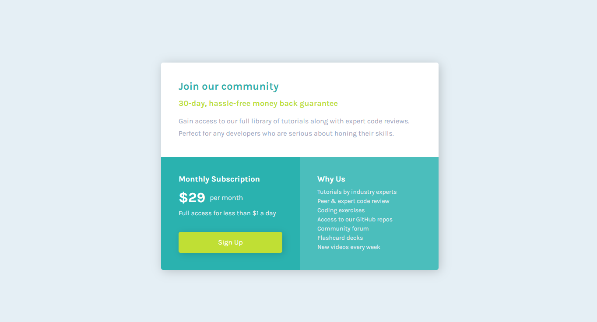

# Frontend Mentor - Single price grid component solution

This is a solution to the [Single price grid component challenge on Frontend Mentor](https://www.frontendmentor.io/challenges/single-price-grid-component-5ce41129d0ff452fec5abbbc). Frontend Mentor challenges help you improve your coding skills by building realistic projects.

## Table of contents

- [Overview](#overview)
  - [The challenge](#the-challenge)
  - [Screenshot](#screenshot)
  - [Links](#links)
- [My process](#my-process)
  - [Built with](#built-with)
  - [What I learned](#what-i-learned)
  - [Continued development](#continued-development)
  - [Useful resources](#useful-resources)
- [Author](#author)

## Overview

### The challenge

Users should be able to:

- View the optimal layout for the component depending on their device's screen size
- See a hover state on desktop for the Sign Up call-to-action

### Screenshot




### Links

- [Solution URL](https://github.com/Harshitsoni2000/Single-Price-Grid-Component)
- [Live Site URL](https://harshitsoni2000.github.io/Single-Price-Grid-Component/)

## My process

### Built with

- Semantic HTML5 markup
- CSS custom properties
- Flexbox
- CSS Grid
- Mobile-first workflow
- [Styled Components](https://cdn.jsdelivr.net/npm/bootstrap@4.6.0/dist/css/bootstrap.min.css) - For styles

### What I learned

I learned about place-self property which can be used in both, flexbox and grid.

```html
<div class="container">Some Code</div>
```
```css
.container {
  place-self: center;
}
```

### Continued development

I want to continue focusing on improving my layout management skills in future projects. These come in handy while building a website.

### Useful resources

- [place-self](https://developer.mozilla.org/en-US/docs/Web/CSS/place-self) - This helped me understand an important property called place-self, which can be used to center an item on the page instead of using both, the justify-content and align-items property.

## Author

- Frontend Mentor - [@Harshitsoni2000](https://www.frontendmentor.io/profile/Harshitsoni2000)
- GitHub - [@Harshitsoni2000](https://github.com/Harshitsoni2000)
